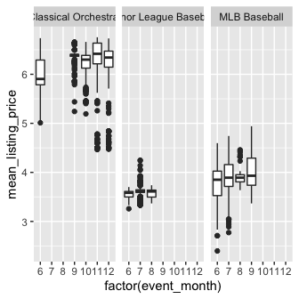

Modeling Assesment
================

# Tickets Listed

## Load in data and Visualizing

``` r
library(tidyverse)
library(xgboost)
library(Matrix)
library(MLmetrics)
library(Metrics)

## load in the data
sales <- read.csv("~/Downloads/assessment_data.tsv", sep = "\t")

## make sure the date in the right format 
sales$listing_date <- as.Date(sales$listing_date)
sales$event_date <- as.Date(sales$event_datetime)

# Getting an idea for variable types 
colnames(sales)
```

    ##  [1] "event_id"              "listing_date"          "event_listing_date_id"
    ##  [4] "taxonomy"              "event_title"           "event_datetime"       
    ##  [7] "tickets_listed"        "mean_listing_price"    "performer_1"          
    ## [10] "performer_2"           "performer_3"           "performer_4"          
    ## [13] "venue_name"            "event_date"

``` r
# [1] "event_id"              "listing_date"          "event_listing_date_id" "taxonomy"             
# [5] "event_title"           "event_datetime"        "tickets_listed"        "mean_eventt_price"   
# [9] "performer_1"           "performer_2"           "performer_3"           "performer_4"          
# [13] "venue_name"     

## Take a look at the data
ggplot(sales, aes(x =listing_date,  y=tickets_listed, color = taxonomy)) +
  geom_point() +
  facet_wrap(~taxonomy)
```

<!-- -->

## Feature Engineering

First thing I noticed when looking at the data is that the different
venues/taxonomy have very different scales when it comes to the ouput
variables. For this reason, log transforming the values makes sense as
to be able to better assess error.

``` r
## log transform the values 
sales$mean_listing_price <- log1p(sales$mean_listing_price)
sales$tickets_listed <- log1p(sales$tickets_listed)
```

Next, given the temporal nature of the listings and day of event,
convert the date to time based features

``` r
##  convert to time-based features
sales$listing_month <- as.numeric(substr(sales$listing_date, 6, 7))
sales$listing_day <- as.numeric(as.factor(weekdays(as.Date(sales$listing_date)))) #day of week
sales$listing_dayDate <- as.numeric(substr(sales$listing_date, 9, 10))
sales$listing_year  <- substr(sales$listing_date, 1, 4)
sales$event_month <- as.numeric(substr(sales$event_date, 6, 7))
sales$event_day <- as.numeric(as.factor(weekdays(as.Date(sales$event_date)))) #day of week
sales$event_dayDate <- as.numeric(substr(sales$event_date, 9, 10))
sales$event_year  <- substr(sales$event_date, 1, 4)
```

Looking above some of the above clusters under taxonomy, some were NA
but clearly orchestral.

``` r
## fix 
sales$taxonomy[is.na(sales$taxonomy)] <- "Classical Orchestral"
```

Finally, I noticed when looking at some event IDs that tickets\_listed
seems to be correlated with how long it has been since the event was
first listed so exploring that and adding a variable for days since
listed.

``` r
## mlb
randombaseballgame <- sales %>% filter(event_id == "3594124")

ggplot(randombaseballgame, aes(x=listing_date, y = tickets_listed)) +
  geom_point() +
  ggtitle(randombaseballgame$event_title)
```

<!-- -->

``` r
## Symphony
randomOrch <- sales %>% filter(event_id == "3799889")
ggplot(randomOrch, aes(x=listing_date, y = tickets_listed)) +
  geom_point() +
  ggtitle(randomOrch$event_title)
```

<!-- -->

``` r
## minor league
RandomMinor <- sales %>% filter(event_id == "3750580")

ggplot(RandomMinor, aes(x=listing_date, y = tickets_listed)) +
  geom_point() +
  ggtitle(RandomMinor$event_title)
```

<!-- -->

``` r
## ADD variable for days since listing
sales <- sales %>% group_by(event_id) %>% mutate(daysSinceListing = row_number() -1 )
```

Next, I wanted to see if there were any patterns between some of the
features and values

``` r
ggplot(sales, aes(x =factor(event_day),  y=tickets_listed)) +
  geom_boxplot() +
  facet_wrap(~taxonomy) +
  theme(legend.position = "none")
```

<!-- -->

``` r
ggplot(sales, aes(x =factor(event_month),  y=tickets_listed)) +
  geom_boxplot() +
  facet_wrap(~taxonomy) +
  theme(legend.position = "none")
```

<!-- -->

``` r
ggplot(sales, aes(x =factor(taxonomy),  y=tickets_listed)) +
  geom_boxplot() +
  theme(legend.position = "none")
```

<!-- -->

## Model Building with xgrboost

``` r
## Test this type of model leaving out some of the known data to validate on
train <- sales %>% filter(listing_date < "2017-07-20")

## leave some behind to validate on
validation <- sales %>% filter(listing_date >= "2017-07-20", listing_date < "2017-08-01")
test <-  sales %>% filter(listing_date >= "2017-08-01")
label <- train$tickets_listed

## Great input train matrix
trainMatrix <- sparse.model.matrix(~ event_month + event_day + taxonomy + daysSinceListing + event_id,
                                   data = train,
                                   contrasts.arg =  c("event_month",
                                                      "event_day",
                                                      "event_year",
                                                      "taxonomy",
                                                      "daysSinceListing" ,
                                                      "event_id"),
                                   sparse = FALSE,
                                   sapsci =FALSE)

#Create input for xgboost
trainDMatrix <- xgb.DMatrix(data = trainMatrix, label = label)

params <- list(booster = "gbtree"
               , objective = "reg:linear"
               , eta=0.4
               , gamma=0
)

#Cross-validation
xgb.tab <- xgb.cv(data = trainDMatrix
                  , param = params
                  , maximize = FALSE, evaluation = "rmse", nrounds = 100
                  , nthreads = 10, nfold = 2, early_stopping_round = 10)
```

    ## [14:41:05] WARNING: amalgamation/../src/objective/regression_obj.cu:171: reg:linear is now deprecated in favor of reg:squarederror.
    ## [14:41:05] WARNING: amalgamation/../src/objective/regression_obj.cu:171: reg:linear is now deprecated in favor of reg:squarederror.
    ## [1]  train-rmse:3.482167+0.022542    test-rmse:3.481736+0.024671 
    ## Multiple eval metrics are present. Will use test_rmse for early stopping.
    ## Will train until test_rmse hasn't improved in 10 rounds.
    ## 
    ## [2]  train-rmse:2.108832+0.012496    test-rmse:2.110081+0.015534 
    ## [3]  train-rmse:1.286790+0.006301    test-rmse:1.289474+0.009707 
    ## [4]  train-rmse:0.801454+0.002800    test-rmse:0.808557+0.007113 
    ## [5]  train-rmse:0.515911+0.003328    test-rmse:0.528556+0.007341 
    ## [6]  train-rmse:0.352888+0.006605    test-rmse:0.371183+0.004703 
    ## [7]  train-rmse:0.264923+0.009150    test-rmse:0.291506+0.000292 
    ## [8]  train-rmse:0.215263+0.010606    test-rmse:0.248196+0.001372 
    ## [9]  train-rmse:0.191168+0.010083    test-rmse:0.230655+0.004159 
    ## [10] train-rmse:0.173643+0.006091    test-rmse:0.219146+0.007228 
    ## [11] train-rmse:0.164449+0.004987    test-rmse:0.213841+0.008702 
    ## [12] train-rmse:0.154730+0.003769    test-rmse:0.207008+0.008454 
    ## [13] train-rmse:0.147848+0.004408    test-rmse:0.202094+0.008177 
    ## [14] train-rmse:0.141699+0.004363    test-rmse:0.199746+0.007504 
    ## [15] train-rmse:0.136615+0.002490    test-rmse:0.196682+0.008958 
    ## [16] train-rmse:0.133180+0.004916    test-rmse:0.196101+0.008321 
    ## [17] train-rmse:0.128267+0.004278    test-rmse:0.194852+0.008185 
    ## [18] train-rmse:0.122423+0.005911    test-rmse:0.190902+0.007972 
    ## [19] train-rmse:0.118511+0.007049    test-rmse:0.189261+0.009691 
    ## [20] train-rmse:0.116378+0.006623    test-rmse:0.188831+0.009703 
    ## [21] train-rmse:0.112012+0.007326    test-rmse:0.187121+0.009473 
    ## [22] train-rmse:0.109772+0.008102    test-rmse:0.185941+0.009183 
    ## [23] train-rmse:0.106422+0.008501    test-rmse:0.184828+0.008841 
    ## [24] train-rmse:0.104124+0.008790    test-rmse:0.183710+0.009626 
    ## [25] train-rmse:0.102112+0.007937    test-rmse:0.183708+0.009836 
    ## [26] train-rmse:0.100560+0.007476    test-rmse:0.182997+0.010198 
    ## [27] train-rmse:0.096851+0.008734    test-rmse:0.181166+0.010034 
    ## [28] train-rmse:0.095878+0.009097    test-rmse:0.180773+0.009804 
    ## [29] train-rmse:0.094223+0.009466    test-rmse:0.180117+0.009924 
    ## [30] train-rmse:0.092636+0.009433    test-rmse:0.179651+0.009606 
    ## [31] train-rmse:0.090215+0.007980    test-rmse:0.179150+0.010023 
    ## [32] train-rmse:0.088051+0.008219    test-rmse:0.178987+0.010269 
    ## [33] train-rmse:0.087018+0.008206    test-rmse:0.179026+0.010376 
    ## [34] train-rmse:0.084853+0.007253    test-rmse:0.178869+0.010660 
    ## [35] train-rmse:0.083583+0.007603    test-rmse:0.178727+0.010715 
    ## [36] train-rmse:0.082793+0.007468    test-rmse:0.178801+0.010595 
    ## [37] train-rmse:0.081787+0.007320    test-rmse:0.178205+0.010670 
    ## [38] train-rmse:0.080604+0.007110    test-rmse:0.177826+0.010766 
    ## [39] train-rmse:0.079595+0.007048    test-rmse:0.177234+0.011314 
    ## [40] train-rmse:0.078511+0.007360    test-rmse:0.177251+0.011316 
    ## [41] train-rmse:0.075997+0.007850    test-rmse:0.176373+0.010599 
    ## [42] train-rmse:0.073799+0.007517    test-rmse:0.176061+0.010179 
    ## [43] train-rmse:0.072880+0.007686    test-rmse:0.175529+0.010237 
    ## [44] train-rmse:0.072113+0.007596    test-rmse:0.175580+0.010238 
    ## [45] train-rmse:0.070696+0.008413    test-rmse:0.175325+0.009948 
    ## [46] train-rmse:0.069020+0.007682    test-rmse:0.175201+0.010003 
    ## [47] train-rmse:0.068626+0.007670    test-rmse:0.175310+0.009984 
    ## [48] train-rmse:0.067099+0.008463    test-rmse:0.174920+0.009831 
    ## [49] train-rmse:0.066429+0.008585    test-rmse:0.174791+0.010009 
    ## [50] train-rmse:0.064611+0.008041    test-rmse:0.174724+0.010095 
    ## [51] train-rmse:0.063066+0.007421    test-rmse:0.174324+0.010205 
    ## [52] train-rmse:0.061356+0.007381    test-rmse:0.174163+0.010504 
    ## [53] train-rmse:0.060059+0.006891    test-rmse:0.173975+0.010598 
    ## [54] train-rmse:0.059356+0.006831    test-rmse:0.173845+0.010840 
    ## [55] train-rmse:0.058790+0.006863    test-rmse:0.173965+0.010792 
    ## [56] train-rmse:0.057876+0.007253    test-rmse:0.173960+0.010838 
    ## [57] train-rmse:0.057134+0.006956    test-rmse:0.173820+0.011028 
    ## [58] train-rmse:0.056766+0.006892    test-rmse:0.173697+0.011216 
    ## [59] train-rmse:0.056189+0.006920    test-rmse:0.173678+0.011192 
    ## [60] train-rmse:0.055489+0.006567    test-rmse:0.173815+0.011267 
    ## [61] train-rmse:0.054931+0.006614    test-rmse:0.173805+0.011212 
    ## [62] train-rmse:0.053814+0.005611    test-rmse:0.173711+0.011321 
    ## [63] train-rmse:0.052886+0.005338    test-rmse:0.173708+0.011521 
    ## [64] train-rmse:0.052310+0.005530    test-rmse:0.173677+0.011520 
    ## [65] train-rmse:0.051766+0.005518    test-rmse:0.173556+0.011607 
    ## [66] train-rmse:0.051208+0.005431    test-rmse:0.173735+0.011512 
    ## [67] train-rmse:0.050857+0.005401    test-rmse:0.173540+0.011620 
    ## [68] train-rmse:0.049587+0.005726    test-rmse:0.173593+0.011927 
    ## [69] train-rmse:0.048770+0.005244    test-rmse:0.173508+0.011918 
    ## [70] train-rmse:0.048171+0.005512    test-rmse:0.173604+0.011724 
    ## [71] train-rmse:0.047379+0.005602    test-rmse:0.173460+0.011605 
    ## [72] train-rmse:0.046691+0.005547    test-rmse:0.173285+0.011598 
    ## [73] train-rmse:0.045595+0.005979    test-rmse:0.173239+0.011502 
    ## [74] train-rmse:0.044418+0.005058    test-rmse:0.172983+0.011590 
    ## [75] train-rmse:0.043705+0.005375    test-rmse:0.172963+0.011613 
    ## [76] train-rmse:0.043353+0.005315    test-rmse:0.172917+0.011618 
    ## [77] train-rmse:0.043093+0.005396    test-rmse:0.172999+0.011593 
    ## [78] train-rmse:0.042757+0.005308    test-rmse:0.173077+0.011604 
    ## [79] train-rmse:0.041654+0.005002    test-rmse:0.173181+0.011662 
    ## [80] train-rmse:0.041356+0.005114    test-rmse:0.173204+0.011607 
    ## [81] train-rmse:0.040433+0.004577    test-rmse:0.173081+0.011756 
    ## [82] train-rmse:0.040026+0.004347    test-rmse:0.173110+0.011730 
    ## [83] train-rmse:0.039670+0.004352    test-rmse:0.173111+0.011765 
    ## [84] train-rmse:0.039324+0.004105    test-rmse:0.173148+0.011736 
    ## [85] train-rmse:0.038866+0.004096    test-rmse:0.173141+0.011607 
    ## [86] train-rmse:0.038581+0.004238    test-rmse:0.173118+0.011621 
    ## Stopping. Best iteration:
    ## [76] train-rmse:0.043353+0.005315    test-rmse:0.172917+0.011618

``` r
#Number of rounds choosen above
num_iterations = xgb.tab$best_iteration


## Create model
model <- xgb.train(data = trainDMatrix
                   , param = params
                   , maximize = FALSE, evaluation = 'rmse', nrounds = num_iterations)
```

    ## [14:41:05] WARNING: amalgamation/../src/objective/regression_obj.cu:171: reg:linear is now deprecated in favor of reg:squarederror.
    ## [14:41:05] WARNING: amalgamation/../src/learner.cc:573: 
    ## Parameters: { "evaluation" } might not be used.
    ## 
    ##   This may not be accurate due to some parameters are only used in language bindings but
    ##   passed down to XGBoost core.  Or some parameters are not used but slip through this
    ##   verification. Please open an issue if you find above cases.

``` r
## Plot feature Importance
importance <- xgb.importance(feature_names = colnames(trainMatrix), model = model)
xgb.ggplot.importance(importance_matrix = importance)
```

<!-- -->

``` r
## Create input validationing matrix
validationMatrix <- sparse.model.matrix(~ event_month + event_day  + taxonomy + daysSinceListing + event_id,
                                  data = validation,
                                  contrasts.arg =  c("event_month",
                                                     "event_day",
                                                     "event_year",
                                                     "taxonomy",
                                                     "daysSinceListing",
                                                     "event_id"),
                                   sparse = FALSE,
                                   sci = FALSE)
```

## Forcast Future Values

Next, we need to use the model above to access the data

``` r
## Forcast future values for the validation
pred <- predict(model, validationMatrix)
validation$tickets_listed_pred <- pred

## Check the accuracy of the validation data
ML <- validation %>% select(tickets_listed, tickets_listed_pred, taxonomy)
ggplot(ML, aes(x=tickets_listed, y = tickets_listed_pred, color = taxonomy))+
  geom_point(alpha = 0.4)
```

<!-- -->

``` r
## Access the validation set
rmse(ML$tickets_listed, ML$tickets_listed_pred)
```

    ## [1] 0.388088

``` r
R2_Score(ML$tickets_listed, ML$tickets_listed_pred)
```

    ## [1] 0.9762273

``` r
## Convert back to readable form
ML$tickets_listed <- round(expm1(ML$tickets_listed))
ML$tickets_listed_pred <- round(expm1(ML$tickets_listed_pred))
head(ML, 20)
```

    ## # A tibble: 20 × 4
    ## # Groups:   event_id [20]
    ##    event_id tickets_listed tickets_listed_pred taxonomy            
    ##       <int>          <dbl>               <dbl> <chr>               
    ##  1  3594065           6029                6235 MLB Baseball        
    ##  2  3594070           8666                9501 MLB Baseball        
    ##  3  3594068           9102                9729 MLB Baseball        
    ##  4  3594103           4910                5975 MLB Baseball        
    ##  5  3594105           3334                4330 MLB Baseball        
    ##  6  3594101           6670                7206 MLB Baseball        
    ##  7  3594108           2234                3855 MLB Baseball        
    ##  8  3798568             24                  27 Classical Orchestral
    ##  9  3594080           8947                9424 MLB Baseball        
    ## 10  3594078           8599                8796 MLB Baseball        
    ## 11  3594063           8876                9080 MLB Baseball        
    ## 12  3594059           8190                8440 MLB Baseball        
    ## 13  3594057           8504                8638 MLB Baseball        
    ## 14  3594061           5662                5804 MLB Baseball        
    ## 15  3931481              7                   6 Classical Orchestral
    ## 16  3799893             39                  39 Classical Orchestral
    ## 17  3799894             33                  33 Classical Orchestral
    ## 18  3799887             39                  39 Classical Orchestral
    ## 19  3799899             39                  37 Classical Orchestral
    ## 20  3799888             19                  26 Classical Orchestral

## Predict the testing data for assessment

``` r
## Create input validationing matrix
testMatrix <- sparse.model.matrix(~ event_month + event_day  + taxonomy + daysSinceListing + event_id,
                                  data = test,
                                  contrasts.arg =  c("event_month",
                                                     "event_day",
                                                     "event_year",
                                                     "taxonomy",
                                                     "daysSinceListing",
                                                     "event_id"),
                                   sparse = FALSE,
                                   sci = FALSE)
## Forcast future values for the validation
pred <- predict(model, testMatrix)

test$tickets_listed <- pred
sales$tickets_listed[match(test$event_listing_date_id, sales$event_listing_date_id)] <- pred
sales$tickets_listed <- round(expm1(sales$tickets_listed))

write.table(sales, "~/Documents/asses/AssessmentOutput.tsv", sep = "\t", quote = F, col.names = T, row.names = T)
```

# Mean Listing Price

## Feature Engineering

First I wanted to look how days since listing effects the price of
tickets. In this case, it didn’t seem to have as clear a correlation so
I will not include the mean\_listing\_price in my model

``` r
## mlb
randombaseballgame <- sales %>% filter(event_id == "3594124")

ggplot(randombaseballgame, aes(x=listing_date, y = mean_listing_price)) +
  geom_point() +
  ggtitle(randombaseballgame$event_title)
```

<!-- -->

``` r
## Symphony
randomOrch <- sales %>% filter(event_id == "3799889")
ggplot(randomOrch, aes(x=listing_date, y = mean_listing_price)) +
  geom_point() +
  ggtitle(randomOrch$event_title)
```

<!-- -->

``` r
## minor league
RandomMinor <- sales %>% filter(event_id == "3750580")

ggplot(RandomMinor, aes(x=listing_date, y = mean_listing_price)) +
  geom_point() +
  ggtitle(RandomMinor$event_title)
```

<!-- -->

Next, I wanted to see if there were any patterns between some of the
features and values

``` r
ggplot(sales, aes(x =factor(event_day),  y=mean_listing_price)) +
  geom_boxplot() +
  facet_wrap(~taxonomy) +
  theme(legend.position = "none")
```

<!-- -->

``` r
ggplot(sales, aes(x =factor(event_month),  y=mean_listing_price)) +
  geom_boxplot() +
  facet_wrap(~taxonomy) +
  theme(legend.position = "none")
```

<!-- -->

``` r
ggplot(sales, aes(x =factor(taxonomy),  y=mean_listing_price)) +
  geom_boxplot() +
  theme(legend.position = "none")
```

<!-- -->

## Model Building with xgrboost

``` r
## Test this type of model leaving out some of the known data to validate on
train <- sales %>% filter(listing_date < "2017-07-20")

## leave some behind to validate on
validation <- sales %>% filter(listing_date >= "2017-07-20", listing_date < "2017-08-01")
test <-  sales %>% filter(listing_date >= "2017-08-01")
label <- train$mean_listing_price

## Great input train matrix
trainMatrix <- sparse.model.matrix(~ event_month + event_day + taxonomy + event_id,
                                   data = train,
                                   contrasts.arg =  c("event_month",
                                                      "event_day",
                                                      "event_year",
                                                      "taxonomy",
                                                      "event_id"),
                                   sparse = FALSE,
                                   sapsci =FALSE)

#Create input for xgboost
trainDMatrix <- xgb.DMatrix(data = trainMatrix, label = label)

params <- list(booster = "gbtree"
               , objective = "reg:linear"
               , eta=0.4
               , gamma=0
)

#Cross-validation
xgb.tab <- xgb.cv(data = trainDMatrix
                  , param = params
                  , maximize = FALSE, evaluation = "rmse", nrounds = 100
                  , nthreads = 10, nfold = 2, early_stopping_round = 10)
```

    ## [14:41:09] WARNING: amalgamation/../src/objective/regression_obj.cu:171: reg:linear is now deprecated in favor of reg:squarederror.
    ## [14:41:09] WARNING: amalgamation/../src/objective/regression_obj.cu:171: reg:linear is now deprecated in favor of reg:squarederror.
    ## [1]  train-rmse:2.592398+0.011722    test-rmse:2.592592+0.013327 
    ## Multiple eval metrics are present. Will use test_rmse for early stopping.
    ## Will train until test_rmse hasn't improved in 10 rounds.
    ## 
    ## [2]  train-rmse:1.576178+0.006286    test-rmse:1.576250+0.008306 
    ## [3]  train-rmse:0.971101+0.003620    test-rmse:0.972979+0.005298 
    ## [4]  train-rmse:0.616388+0.001889    test-rmse:0.618805+0.003665 
    ## [5]  train-rmse:0.414348+0.001317    test-rmse:0.417215+0.000443 
    ## [6]  train-rmse:0.303681+0.000179    test-rmse:0.309074+0.000316 
    ## [7]  train-rmse:0.248582+0.001316    test-rmse:0.255853+0.000150 
    ## [8]  train-rmse:0.222403+0.001144    test-rmse:0.231695+0.003154 
    ## [9]  train-rmse:0.210603+0.001312    test-rmse:0.220631+0.004024 
    ## [10] train-rmse:0.204818+0.000488    test-rmse:0.215663+0.004646 
    ## [11] train-rmse:0.200059+0.001278    test-rmse:0.212140+0.005029 
    ## [12] train-rmse:0.198014+0.000272    test-rmse:0.210371+0.004322 
    ## [13] train-rmse:0.196175+0.000535    test-rmse:0.208979+0.003614 
    ## [14] train-rmse:0.195566+0.000706    test-rmse:0.208752+0.003537 
    ## [15] train-rmse:0.194774+0.000437    test-rmse:0.207700+0.003152 
    ## [16] train-rmse:0.194363+0.000487    test-rmse:0.207312+0.003261 
    ## [17] train-rmse:0.193872+0.000243    test-rmse:0.206987+0.003228 
    ## [18] train-rmse:0.193475+0.000095    test-rmse:0.206270+0.002826 
    ## [19] train-rmse:0.193225+0.000052    test-rmse:0.206149+0.002752 
    ## [20] train-rmse:0.193080+0.000055    test-rmse:0.206016+0.002647 
    ## [21] train-rmse:0.192822+0.000051    test-rmse:0.206029+0.002797 
    ## [22] train-rmse:0.192666+0.000071    test-rmse:0.205938+0.002516 
    ## [23] train-rmse:0.192596+0.000050    test-rmse:0.205769+0.002425 
    ## [24] train-rmse:0.192512+0.000114    test-rmse:0.205747+0.002243 
    ## [25] train-rmse:0.192472+0.000117    test-rmse:0.205726+0.002268 
    ## [26] train-rmse:0.192427+0.000092    test-rmse:0.205723+0.002323 
    ## [27] train-rmse:0.192383+0.000082    test-rmse:0.205705+0.002307 
    ## [28] train-rmse:0.192320+0.000087    test-rmse:0.205607+0.002208 
    ## [29] train-rmse:0.192238+0.000083    test-rmse:0.205383+0.002051 
    ## [30] train-rmse:0.192220+0.000093    test-rmse:0.205315+0.001998 
    ## [31] train-rmse:0.192188+0.000071    test-rmse:0.205301+0.001947 
    ## [32] train-rmse:0.192174+0.000078    test-rmse:0.205317+0.001952 
    ## [33] train-rmse:0.192130+0.000061    test-rmse:0.205251+0.001893 
    ## [34] train-rmse:0.192106+0.000052    test-rmse:0.205168+0.001819 
    ## [35] train-rmse:0.192094+0.000053    test-rmse:0.205142+0.001783 
    ## [36] train-rmse:0.192089+0.000055    test-rmse:0.205153+0.001799 
    ## [37] train-rmse:0.192078+0.000046    test-rmse:0.205166+0.001806 
    ## [38] train-rmse:0.192069+0.000042    test-rmse:0.205181+0.001791 
    ## [39] train-rmse:0.192063+0.000043    test-rmse:0.205184+0.001783 
    ## [40] train-rmse:0.192057+0.000044    test-rmse:0.205118+0.001721 
    ## [41] train-rmse:0.192043+0.000042    test-rmse:0.205124+0.001695 
    ## [42] train-rmse:0.192037+0.000041    test-rmse:0.205112+0.001683 
    ## [43] train-rmse:0.192033+0.000037    test-rmse:0.205124+0.001679 
    ## [44] train-rmse:0.192026+0.000040    test-rmse:0.205055+0.001607 
    ## [45] train-rmse:0.192020+0.000041    test-rmse:0.205012+0.001569 
    ## [46] train-rmse:0.192018+0.000042    test-rmse:0.205008+0.001566 
    ## [47] train-rmse:0.192013+0.000042    test-rmse:0.205012+0.001561 
    ## [48] train-rmse:0.192011+0.000041    test-rmse:0.205003+0.001547 
    ## [49] train-rmse:0.192010+0.000041    test-rmse:0.205007+0.001550 
    ## [50] train-rmse:0.192006+0.000042    test-rmse:0.204967+0.001500 
    ## [51] train-rmse:0.192002+0.000043    test-rmse:0.204970+0.001500 
    ## [52] train-rmse:0.192001+0.000043    test-rmse:0.204954+0.001493 
    ## [53] train-rmse:0.191999+0.000043    test-rmse:0.204948+0.001487 
    ## [54] train-rmse:0.191997+0.000044    test-rmse:0.204935+0.001475 
    ## [55] train-rmse:0.191997+0.000043    test-rmse:0.204937+0.001475 
    ## [56] train-rmse:0.191996+0.000043    test-rmse:0.204934+0.001480 
    ## [57] train-rmse:0.191995+0.000042    test-rmse:0.204939+0.001479 
    ## [58] train-rmse:0.191994+0.000042    test-rmse:0.204942+0.001482 
    ## [59] train-rmse:0.191993+0.000043    test-rmse:0.204925+0.001468 
    ## [60] train-rmse:0.191992+0.000042    test-rmse:0.204925+0.001458 
    ## [61] train-rmse:0.191992+0.000042    test-rmse:0.204922+0.001453 
    ## [62] train-rmse:0.191992+0.000041    test-rmse:0.204923+0.001453 
    ## [63] train-rmse:0.191991+0.000042    test-rmse:0.204924+0.001454 
    ## [64] train-rmse:0.191991+0.000042    test-rmse:0.204905+0.001435 
    ## [65] train-rmse:0.191990+0.000042    test-rmse:0.204906+0.001437 
    ## [66] train-rmse:0.191990+0.000042    test-rmse:0.204906+0.001431 
    ## [67] train-rmse:0.191990+0.000042    test-rmse:0.204902+0.001427 
    ## [68] train-rmse:0.191990+0.000042    test-rmse:0.204907+0.001426 
    ## [69] train-rmse:0.191990+0.000042    test-rmse:0.204907+0.001426 
    ## [70] train-rmse:0.191990+0.000042    test-rmse:0.204908+0.001426 
    ## [71] train-rmse:0.191990+0.000042    test-rmse:0.204909+0.001425 
    ## [72] train-rmse:0.191989+0.000041    test-rmse:0.204908+0.001426 
    ## [73] train-rmse:0.191989+0.000041    test-rmse:0.204908+0.001426 
    ## [74] train-rmse:0.191989+0.000041    test-rmse:0.204908+0.001426 
    ## [75] train-rmse:0.191989+0.000041    test-rmse:0.204908+0.001426 
    ## [76] train-rmse:0.191989+0.000041    test-rmse:0.204908+0.001426 
    ## [77] train-rmse:0.191989+0.000041    test-rmse:0.204908+0.001426 
    ## Stopping. Best iteration:
    ## [67] train-rmse:0.191990+0.000042    test-rmse:0.204902+0.001427

``` r
#Number of rounds choosen above
num_iterations = xgb.tab$best_iteration


## Create model
model <- xgb.train(data = trainDMatrix
                   , param = params
                   , maximize = FALSE, evaluation = 'rmse', nrounds = num_iterations)
```

    ## [14:41:10] WARNING: amalgamation/../src/objective/regression_obj.cu:171: reg:linear is now deprecated in favor of reg:squarederror.
    ## [14:41:10] WARNING: amalgamation/../src/learner.cc:573: 
    ## Parameters: { "evaluation" } might not be used.
    ## 
    ##   This may not be accurate due to some parameters are only used in language bindings but
    ##   passed down to XGBoost core.  Or some parameters are not used but slip through this
    ##   verification. Please open an issue if you find above cases.

``` r
## Plot feature Importance
importance <- xgb.importance(feature_names = colnames(trainMatrix), model = model)
xgb.ggplot.importance(importance_matrix = importance)
```

<!-- -->

``` r
## Create input validationing matrix
validationMatrix <- sparse.model.matrix(~ event_month + event_day  + taxonomy + event_id,
                                  data = validation,
                                  contrasts.arg =  c("event_month",
                                                     "event_day",
                                                     "event_year",
                                                     "taxonomy",
                                                     "event_id"),
                                   sparse = FALSE,
                                   sci = FALSE)
```

## Forcast Future Values

Next, we need to use the model above to access the data

``` r
## Forcast future values for the validation
pred <- predict(model, validationMatrix)
validation$mean_listing_price_pred <- pred

## Check the accuracy of the validation data
ML <- validation %>% select(mean_listing_price, mean_listing_price_pred, taxonomy)
ggplot(ML, aes(x=mean_listing_price, y = mean_listing_price_pred, color = taxonomy))+
  geom_point(alpha = 0.4)
```

<!-- -->

``` r
## Access the validation set
rmse(ML$mean_listing_price, ML$mean_listing_price_pred)
```

    ## [1] 0.1858257

``` r
R2_Score(ML$mean_listing_price, ML$mean_listing_price_pred)
```

    ## [1] 0.9776531

``` r
## Convert back to readable form
ML$mean_listing_price <- round(expm1(ML$mean_listing_price))
ML$mean_listing_price_pred <- round(expm1(ML$mean_listing_price_pred))
head(ML, 20)
```

    ## # A tibble: 20 × 4
    ## # Groups:   event_id [20]
    ##    event_id mean_listing_price mean_listing_price_pred taxonomy            
    ##       <int>              <dbl>                   <dbl> <chr>               
    ##  1  3594065                 71                      65 MLB Baseball        
    ##  2  3594070                 48                      49 MLB Baseball        
    ##  3  3594068                 33                      32 MLB Baseball        
    ##  4  3594103                 46                      47 MLB Baseball        
    ##  5  3594105                 54                      45 MLB Baseball        
    ##  6  3594101                 26                      37 MLB Baseball        
    ##  7  3594108                 28                      29 MLB Baseball        
    ##  8  3798568                452                     467 Classical Orchestral
    ##  9  3594080                 50                      50 MLB Baseball        
    ## 10  3594078                 43                      40 MLB Baseball        
    ## 11  3594063                 32                      33 MLB Baseball        
    ## 12  3594059                 48                      53 MLB Baseball        
    ## 13  3594057                 39                      44 MLB Baseball        
    ## 14  3594061                 99                      73 MLB Baseball        
    ## 15  3931481                348                     373 Classical Orchestral
    ## 16  3799893                598                     611 Classical Orchestral
    ## 17  3799894                600                     630 Classical Orchestral
    ## 18  3799887                598                     610 Classical Orchestral
    ## 19  3799899                598                     596 Classical Orchestral
    ## 20  3799888                352                     376 Classical Orchestral

## Predict the testing data for assessment

``` r
## Create input validationing matrix
testMatrix <- sparse.model.matrix(~ event_month + event_day  + taxonomy  + event_id,
                                  data = test,
                                  contrasts.arg =  c("event_month",
                                                     "event_day",
                                                     "event_year",
                                                     "taxonomy",
                                                     "event_id"),
                                   sparse = FALSE,
                                   sci = FALSE)
## Forcast future values for the validation
pred <- predict(model, testMatrix)

test$mean_listing_price <- pred
sales$mean_listing_price[match(test$event_listing_date_id, sales$event_listing_date_id)] <- pred

## Convert whole df back to nonlog
sales$mean_listing_price <- round(expm1(sales$mean_listing_price))
write.table(sales, "~/Documents/asses/AssessmentOutput.tsv", sep = "\t", quote = F, col.names = T, row.names = T)
```
